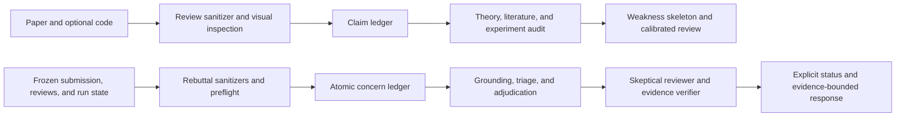

<p align="center">
  
</p>

<p align="center">
  <a href="https://docs.claude.com/en/docs/claude-code"></a>
  <a href="SKILLS.md"></a>
  <a href="commands/"></a>
  <a href="agents/"></a>
  <a href="docs/knowledge-base.md"></a>
  <a href="LICENSE"></a>
  <a href="https://github.com/Vepricov/claude-brainlab/stargazers"></a>
</p>

<p align="center">
  <a href="#overview">Overview</a> ·
  <a href="#lab-knowledge-the-shared-research-base">Lab Knowledge</a> ·
  <a href="#the-toolkit-skills-commands-agents-hooks">The toolkit</a> ·
  <a href="#install">Install</a> ·
  <a href="#for-brain-lab-members">For lab members</a> ·
  <a href="SKILLS.md">All 75 skills</a>
</p>

## Overview

`claude-brainlab` is the working configuration of a machine-learning research lab, packaged so that
someone else can install it. It turns [Claude Code](https://docs.claude.com/en/docs/claude-code) into a
workbench that covers a research day end to end: find the paper, read it properly, run the experiment,
write the paper, survive the review — and leave every step in a base the rest of the lab can search.

What it actually gives you:

- **A literature pipeline that does not hallucinate metadata.** An arXiv link becomes a Zotero item with
  its PDF, a vault note with an eight-section analysis, an AlphaXiv mirror entry and a bibliography
  entry. BibTeX comes from external APIs, never from a model, and a hook blocks any `\cite{}` key that
  is missing from `references.bib`.
- **A shared research base over MCP.** Hypotheses with falsifiers, experiments with status, evidence tied
  to its artifact, decisions with their grounds, and 490+ read papers — one search over all of it. See
  [Lab Knowledge](#lab-knowledge-the-shared-research-base).
- **Experiment work that survives the night.** Per-project SSH and GPU routing, long runs in `tmux`,
  loops that append timestamped progress to an experiment note and refresh the plot, and a queue with a
  circuit breaker instead of a job list that burns down silently.
- **Writing and review with teeth.** Beamer decks in a terminal-style theme, A\*-grade internal review
  (reviewer + theoretician + literature scout + experiments auditor), and a rebuttal workflow where
  every claim must point at the submitted paper or a verified artifact.
- **Obsidian as the personal half.** Project hub cards, daily research logs, experiment logs, hard-link
  de-duplication for a paper that belongs in two folders, and routing rules so notes land where they
  belong instead of a `Research/` dump.
- **Memory across sessions.** MemPalace integration with auto-save, so the next session starts knowing
  what the last one decided.

> [!TIP]
> Everything works without lab access. The installer skips the Lab Knowledge server when
> `LAB_MCP_URL` and `LAB_MCP_TOKEN` are unset, and Obsidian-routed skills no-op without a vault.

## Lab Knowledge: the shared research base

The lab runs a knowledge service that this toolkit talks to over MCP. It answers the question a lab
loses most often: *has anyone here already tried this, and what came out of it?*

It holds two corpora side by side and searches both at once:

- **What the lab knows** — hypotheses with their falsifiers, experiments with their status, evidence
  tied to the artifact it came from, derivations for the claims that are closed by a proof rather than
  a run, decisions and the evidence they rest on. Every record has a stable code such as `H-DYC-001`,
  so it can be cited in a paper, a call or a message and still resolve a year later.
- **What the lab has read** — 490+ papers with their full reading notes, split into sections, plus
  authors, venue, BibTeX key and code links, and the claims those papers make: each one quoted from
  the paper's text, so "this paper contradicts us" points at a sentence instead of at twenty pages.

What makes it useful rather than another database:

| | |
|---|---|
| **Research themes, not folders** | A theme is the entry point: `get_theme_context` returns the hypotheses, experiments, decisions **and** the literature of one research area together. Papers belong to several themes when they honestly do. |
| **Hybrid search over both corpora** | Word search and semantic search fused by reciprocal rank, one ordering for lab records and literature, with lab knowledge weighted slightly above papers and a floor kept for literature so "what do the papers say" always gets an answer. Embeddings run locally, so search costs no tokens. |
| **A computed bridge, not hand-made links** | Subject tags come from a term dictionary matched against the text, so a hypothesis about spectral norms finds the papers about spectral norms, and every tag can be traced to the sentence it was found in. |
| **A record that outsiders can read** | Reads are lab-wide, so every project keeps a registry of its internal names — build nicknames, run ids, local protocol names. Defining a name is retroactive: one definition made seventy existing records readable without editing any of them, and the definition itself is findable by search. |
| **Support that can be checked** | A theoretical claim is closed by a derivation with its assumptions and completeness, never by a run with a proof stuffed into its protocol. A decision names the evidence under it. A quote from an outside paper is verified against that paper's stored text, and one that is not in it is refused. |
| **Contributions need nothing but an id** | `upsert_paper(title=…, arxiv_id=…)` is a complete contribution: no vault, no Zotero, no folder. Fields you leave empty never erase stored ones, sections are replaced only when you send some, and every write names its author in the audit log. |
| **Human-facing views stay in sync** | Approved records are published to Yonote project pages and named project boards; the raw private notes stay in Obsidian. |
| **Nothing is written by accident** | A stop hook interrupts the end of a turn every few exchanges and asks the agent to save what happened, so records are written deliberately, by something that has the whole context, and reported back in one line. |

Read [`docs/knowledge-base.md`](docs/knowledge-base.md) for the four ways in and the rules that hold
for everybody, and [`docs/llm-providers.md`](docs/llm-providers.md) for which model does which job.

## For BRAIn Lab members

This repository is the open half: skills, rules, hooks and the installer. The lab's own half — the
knowledge service with its data, the meeting pipeline, and the tests that carry real names — stays in a
private repository inside the [brain-lab-research](https://github.com/brain-lab-research) organisation.
Access comes with team membership: if you work at BRAIn Lab, join the
[GitHub team](https://github.com/orgs/brain-lab-research/teams) and you get the internal repository
together with a token for the shared knowledge base.

| | Where |
|---|---|
| Canonical repository, issues and pull requests | [Vepricov/claude-brainlab](https://github.com/Vepricov/claude-brainlab) |
| Organisation fork, kept in sync | [brain-lab-research/claude-brainlab](https://github.com/brain-lab-research/claude-brainlab) |
| Lab organisation and papers | [github.com/brain-lab-research](https://github.com/brain-lab-research) |
| Internal half: knowledge service, data, call pipeline | private, granted with team membership |

| Read this | If you want to |
|---|---|
| [`docs/knowledge-base.md`](docs/knowledge-base.md) | contribute papers or records to the shared base, with or without Obsidian and Zotero |
| [`docs/llm-providers.md`](docs/llm-providers.md) | know which model does which job, what it costs, and what must never be model-generated |
| [`docs/reference-setup.md`](docs/reference-setup.md) | copy a configuration that works, including the parts that broke first |

## The toolkit: skills, commands, agents, hooks

| | Count | What it is | Where |
|---|---|---|---|
| **Skills** | 75 | the working units: literature, experiments, Obsidian, code, writing, review | [`skills/`](skills/) |
| **Slash commands** | 37 | `/paper-ingest`, `/want-2-read`, `/analyze-results`, `/rebuttal`, … | [`commands/`](commands/) |
| **Agents** | 16 | `code-reviewer`, `bug-analyzer`, `paper-miner`, `obsidian-hub-creator`, … | [`agents/`](agents/) |
| **Hooks** | 7 | security guard, citation validator, session start/stop, memory auto-save, skill activation | [`hooks/`](hooks/) |
| **Rules** | 6 | coding style, citations, security, agent orchestration, code workflow, server hygiene | [`rules/`](rules/) |
| **Templates** | — | `settings.json.template`, `.env.example`, project-mapping example | repo root |

<details>
<summary><b>What the 75 skills cover</b> — the full catalogue with trigger phrases is in <a href="SKILLS.md">SKILLS.md</a></summary>

| Area | Skills you will actually type |
|---|---|
| **Literature** | `paper-ingest`, `paper-search`, `want-2-read`, `obsidian-literature-workflow`, `zotero-obsidian-bridge`, `citation-verification` |
| **Experiments** | `results-analysis`, `results-report`, `obsidian-experiment-log`, `handoff-to-jarvis`, `diagnose`, `verification-loop` |
| **Writing** | `ml-paper-writing`, `new-paper`, `writing-anti-ai`, `presentation`, `paper-to-social` |
| **Review** | `astar-paper-review`, `review-response`, `grill-me`, `grill-with-docs` |
| **Knowledge** | `lab-knowledge`, `lab-project-onboarding`, `call-notes`, `create-project`, `obsidian-project-memory`, `obsidian-synthesis-map` |
| **Engineering** | `code-ingest`, `code-library`, `code-review-excellence`, `tdd`, `bug-detective`, `git-workflow`, `uv-package-manager` |
| **Ideas and planning** | `research-ideation`, `planning-with-files`, `zoom-out`, `architecture-design`, `improve-codebase-architecture` |

</details>

## Highlights — what you won't find upstream

The repository started from `claude-scholar` (see [Credits](#credits)); these are the parts that grew
here. Per-skill detail for all 75 skills is in [`SKILLS.md`](SKILLS.md).

- **`paper-ingest`** — end-to-end pipeline: arXiv URL → BibTeX (external API, never LLM-generated) → PDF → Zotero parent item with PDF child attachment → Obsidian note with 8-section AI Explanation written by Haiku → mandatory final audit.
- **`want-2-read`** — process a Markdown reading queue with one fan-out agent per paper, each invoking `paper-ingest`, plus a final review agent for quality control.
- **`paper-search`** — library-aware arXiv shortlists that don't re-suggest already ingested papers.
- **`astar-paper-review`** — top-venue-grade peer review: reviewer + theoretician (proofs) + literature-scout + experiments-auditor, prompt-injection-safe, one review file per paper.
- **`paper-to-social`** — turn a paper into copy-paste-ready Telegram / X / Habr posts with arXiv figures, in your own voice.
- **`code-ingest`** / **`code-library`** — map an external repo into Obsidian Code-library notes (`path:line`, no code copied) and document the whole code workflow.
- **`create-project`** / **`lab-project-onboarding`** — set up the private repository and Obsidian hub, then idempotently bind a Brain Lab project to its shared MCP record, human-facing Yonote page, and named project Kanban.
- **`lab-knowledge`** / **`publish-hypothesis`** — Ask Lab runs inside the user's local agent and reads shared research context from Lab Knowledge MCP. Private drafts stay in Obsidian until an explicit curated publication preview is approved. Yonote is the clean human-facing project view.
- **`call-notes`** — keeps the raw meeting narrative private in Obsidian, publishes approved research records to Lab Knowledge, and creates laboratory tasks only on the bound Yonote project board. This replaces the old ad-hoc per-project task file convention.
- **Obsidian integration** — hard-link rule for the same paper in multiple folders, project-memory bootstrap, experiment log, daily research log, link-graph repair, synthesis maps.
- **MemPalace integration** — durable conversation memory with auto-save on every turn (off by default for new installs).
- **`presentation`** — Beamer-first slide skill with a built-in **terminal-style** theme (dark, monospace, bright-green accent). One source of truth for talks, posters and promotion content.

## Evidence-first paper review and rebuttal

The repository includes two related skills for internal A* conference work. They share the same rule: every important judgment must point to the submitted paper or a verified artifact. Both ship native Codex metadata in `agents/openai.yaml`. The rebuttal skill reuses the audited PDF sanitizer bundled with the review skill, so the two directories should be installed together.

| Skill | Main question | Required inputs | Primary output |
|---|---|---|---|
| [`astar-paper-review`](skills/astar-paper-review/) | Is the submitted claim correct, novel, and supported? | Paper, supplement, optional code and annotations | Evidence-backed review with a weakness skeleton, questions, limitations, and calibrated score |
| [`review-response`](skills/review-response/) | What would actually resolve each reviewer concern? | Frozen submission, reviews, discussion, optional code, configs, logs, and running-job state | Canonical evidence packet, explicit completion status, and a draft or verified final response when the gates permit it |



The review skill schedules its nested theory coordinator so that the coordinator can spawn two children within a four-slot runtime. The rebuttal skill stages all roles within the same limit and documents a sequential fallback. In both workflows, one coordinator owns the canonical ledger. Specialist agents return structured evidence, not competing final drafts. Load-bearing findings are checked again before they affect a score or response stance.

### `astar-paper-review`

Use `$astar-paper-review` to review an ML paper from the submission PDF, supplement, and optional code. The full procedure is in [`skills/astar-paper-review/SKILL.md`](skills/astar-paper-review/SKILL.md).

#### Intake and claim ledger

The bundled extractor redacts detected high-confidence prompt-injection patterns and flags selected suspicious text before agent fan-out. It preserves page boundaries, reports detections, and recovers user PDF annotations. A page with very little extracted text and embedded images stops with `OCR_REQUIRED`. The skill also requires visual inspection of the first and last pages, low-text pages, and pages with large rasterized text. This is defense in depth, not a guarantee that every hostile instruction will be detected. Local LaTeX sources take precedence when they are available.

The coordinator then records every material theory, empirical, novelty, efficiency, reproducibility, and scope claim. Each ledger row contains the exact paper location, required support, observed evidence, and audit status.

#### Theory audit

Formal claims get a dedicated theory tree:

1. A proof and assumptions auditor reconstructs the load-bearing derivation, checks joint satisfiability, and tests boundary cases.
2. A rate and prior-art comparator reads the closest primary theorems and normalizes their settings.
3. The theory coordinator checks the bridge from the proved update to the stated and implemented algorithms.

The comparison matrix includes the submitted theorem, the method with its new mechanism disabled, the closest same-setting theorem, and a canonical baseline such as SGD, momentum SGD, SignSGD, or standard zeroth-order optimization. It aligns objective class, oracle, assumptions, convergence criterion, initialization, dimension, calls per iteration, total query cost, memory, and hidden constants. If the criteria cannot be converted, the results are marked `not directly comparable`.

#### Experimental forensics

The experiments auditor follows the chain:

```text
claim -> protocol -> configuration -> raw evidence -> reported number
```

It checks tuning parity, seed protocol, uncertainty, data leakage, selected checkpoints, query or compute budgets, paper-code consistency, and numerical arithmetic. Code execution is optional and isolated. A static config inspection, a smoke test, and an independent reproduction are reported as different evidence levels.

#### Review output

Before prose, the skill shows a short severity-ranked weakness skeleton. The user can remove a weak concern or redirect the audit before scores are assigned. The final review contains:

- a neutral contribution summary
- specific strengths and grouped weaknesses
- questions whose answers could change the recommendation
- acknowledged and unacknowledged limitations
- a statement of proof coverage, empirical evidence level, and checks not completed.

The skill never converts missing seeds into an accusation of fabrication, calls a smoke test a reproduction, or treats matching Big-O notation under different assumptions as an improvement.

```text
Use $astar-paper-review to review this submission and audit its theory,
closest prior work, experiments, and reproducibility.
```

### `review-response`

Use `$review-response` with the submitted paper, reviewer reports, and any available experiment artifacts. The complete workflow is in [`skills/review-response/SKILL.md`](skills/review-response/SKILL.md).

#### Freeze the submission and map the reviews

The workflow stores the original paper, supplement, code snapshot, reviews, later comments, and experiment state separately from all rebuttal revisions. The PDF and text sanitizers redact detected high-confidence injection patterns. Review-export mode uses narrower rules so legitimate reviewer recommendations remain visible. Raw artifacts are retained for provenance, and sanitized copies become canonical agent input.

Every review is split into atomic IDs such as `R2-C03`. A concern row records:

```text
reviewer claim -> attacked component -> decision relevance -> paper anchors
-> existing evidence -> missing evidence -> response stance -> risk -> status
```

Coverage must reach 100 percent before drafting. Duplicate concerns can share evidence, but none disappears from the ledger.

#### Existing evidence before new experiments

The coordinator inventories completed, running, queued, failed, and cancelled runs before proposing work. Each run records method identity, setting, seeds, artifact paths, verification state, and failure or exclusion reason. This prevents the skill from recommending an expensive run that the team has already finished.

New experiments are chosen by the reviewer's decision test. The preferred test changes one disputed factor and keeps the rest fixed. The plan states the positive, null, and negative interpretation before launch. Broad benchmark expansion is rejected when a smaller causal control or matched baseline answers the concern.

The method-identity gate distinguishes:

- `same-method`, which evaluates the submitted method unchanged
- `local-fix`, which repairs a narrow bug or missing control and discloses the delta
- `core-revision`, which changes a defining source, objective, representation, theorem setting, or evaluation contract.

Results from a core revision are quarantined. They may motivate a resubmission, but they cannot silently defend the original paper. A labeled comparator or swap-only ablation may differ from the submission when the submitted arm remains unchanged.

#### Evidence levels

| Level | Evidence available | Safe interpretation |
|---|---|---|
| E0 | Proposal without an artifact | Planned work only |
| E1 | Claim or number in the submission | The paper reports it |
| E2 | Config, table, log, or reported arithmetic checked | Static artifact confirmation |
| E3 | Reproducible smoke test or one completed run | Result in this run, without robustness claims |
| E4 | Frozen paired multi-seed protocol with uncertainty | Repeated evidence within the tested setting |
| E5 | Independent replication or broad preregistered-style validation | Strong claim within the validated scope |

A one-seed result stays E3. A mean without seed identities, dispersion, or raw outputs is at most E2.

#### Theory, strategy, and drafting

Theory concerns use the same nested proof and rate-comparison structure as the review skill. Empirical concerns go to an experiment triage lead. A response strategist then selects an explicit stance for every concern: correct, clarify, defend, concede locally, narrow, revise, run a test, or state that the issue cannot be resolved.

The draft is composed from the adjudicated ledger. Each major answer follows a compact structure:

```text
direct answer -> decisive evidence -> exact paper change -> residual limitation
```

The final pass uses two independent roles. A skeptical reviewer/AC asks what objection remains. An evidence verifier traces every number, theorem statement, citation, and revision promise back to an artifact, then checks cross-review consistency and venue limits.

#### Canonical artifacts

The workflow keeps a resumable packet instead of one opaque response:

- `00-preflight.md` and `00-experiment-registry.md`
- `01-concern-ledger.md`
- `02-evidence-plan.md`
- `03-adjudication.md`
- `04-rebuttal-draft.md`
- `05-verification-report.md`
- `final-rebuttal.md`.

The final status is one of `BLOCKED`, `AWAITING_EXPERIMENT_APPROVAL`, `EVIDENCE_IN_PROGRESS`, `DRAFT_READY`, `VERIFIED_WITH_LIMITATIONS`, or `VERIFIED`. A draft is never presented as final before the adversarial and evidence gates pass.

The skill also distinguishes post-hoc rescoring from optimization under a new reward judge, checks paper-to-code tensor shapes and parameter counts, and requires profiling artifacts before claiming that a requested baseline is infeasible.

```text
Use $review-response to map these reviews, triage the available runs,
and prepare an evidence-grounded rebuttal strategy.
```

Both skills include compact lessons extracted from real laboratory review and rebuttal cases. Those cards preserve reusable diagnostic moves, not conclusions or canned prose. Current submission artifacts, verified primary literature, official venue rules, and verified experiment evidence remain authoritative for the task at hand.

These skills improve scientific coverage and response discipline. They do not promise acceptance or replace the authors' judgment.

## The `presentation` skill

A LaTeX Beamer skill for theory talks, mathematical decks, and conference presentations. It enforces:

- **One mathematical chain** — every new formula must be motivated by the previous slide. No fact-bag decks.
- **Stable notation** across the whole talk; if you reject a notation choice once, the skill keeps the preferred one in later edits.
- **Russian prose by default** for slide bodies (English for code, method names, file paths). Configurable in `skills/presentation/references/user-presentation-preferences.md`.
- **Overflow is an error** — `Overfull \hbox/\vbox` and `Frame text is shrunk` warnings are treated as layout failures. The skill cuts text, splits frames, or rebalances columns instead of shrinking aggressively.

### Terminal style (the dark theme)

When you say `terminal style`, the skill applies a custom Beamer theme defined in [`skills/presentation/examples/terminal-style-mini.tex`](skills/presentation/examples/terminal-style-mini.tex). Compile that file to preview the look.

Visual contract (also documented in [`skills/presentation/examples/terminal-style-notes.md`](skills/presentation/examples/terminal-style-notes.md)):

| Element | Value |
|---|---|
| Theme base | `\usetheme{metropolis}` |
| Aspect ratio | 16:9 (`aspectratio=169`) |
| Background | `#0D1117` |
| Card / title bar | `#161B22` |
| Primary accent (titles, frame headers) | `#00FF88` |
| Secondary accent (subtitles) | `#58A6FF` |
| Theorem / proof accent | `#FF7B54` |
| Body text | `#E6EDF3` |
| Muted text | `#8B949E` |
| Title font | monospace bold (`\ttfamily\bfseries`) |
| Frame title font | monospace bold |
| Theorem/idea blocks | `tcolorbox` with thin colored left rule |
| Title slide | `// header` line + thin rules + large title + terminal-like `$ run --topic ...` footer |
| Section dividers | `// 01`, `// 02`, ... + one large title, no other content |
| Final slide | closing thanks and questions line, same visual language as title |

The `presentation` skill routes `terminal style` requests to this canonical example, so a request for "make me a NeurIPS talk in terminal style" produces a deck with this exact look.

To customize the theme: edit `skills/presentation/examples/terminal-style-mini.tex` (or fork it into your project), rerun `bash install/setup.sh` if you want it propagated to `~/.claude/`.

## Install

```bash
git clone https://github.com/<you>/claude-brainlab.git
cd claude-brainlab
bash install/bootstrap.sh   # interactive — fills .env
bash install/setup.sh       # backup-aware copy to ~/.claude/
```

Restart Claude Code afterwards. To roll back: `bash install/uninstall.sh`.

See the prerequisites table below before installing.

## Customize

Most paths and identifiers are driven by `.env`. To change a hook, skill, or rule, edit it in this repo and re-run `bash install/setup.sh` — your existing `~/.claude` is backed up first. Per-skill customization (Zotero parent keys, vault folder taxonomy, MemPalace wing names) lives in each skill's `SKILL.md`.

## Prerequisites

| | Required | Optional |
|---|---|---|
| Claude Code | ✓ | |
| Python 3.10+ | ✓ | |
| Node.js (for hooks) | ✓ | |
| `rsync` | ✓ | |
| Obsidian | | recommended (Obsidian-routed skills no-op without it) |
| Zotero + zotero-mcp | | recommended for `paper-ingest` / `want-2-read` |
| MemPalace | | recommended for cross-session memory |
| Yonote API | | recommended for shared project tasks and project views |
| Lab Knowledge MCP | | recommended for shared hypotheses and evidence |

## Credits

- [Galaxy-Dawn/claude-scholar](https://github.com/Galaxy-Dawn/claude-scholar) (MIT) — the starting
  point: the original skill catalogue, agent set and install pattern. Most of what is here now was
  written after that fork, but the shape of the installer and the skill layout come from it.
- [kepano/obsidian-skills](https://github.com/kepano/obsidian-skills) — vendored Obsidian utility skills (`obsidian-markdown`, `obsidian-cli`, `obsidian-bases`, `json-canvas`, `defuddle`). See `skills/obsidian-skills.UPSTREAM-LICENSE.txt`.
- [MemPalace](https://github.com/MemPalace/mempalace) — the local-first memory MCP this config plugs into.

## License

MIT. See [`LICENSE`](LICENSE).
